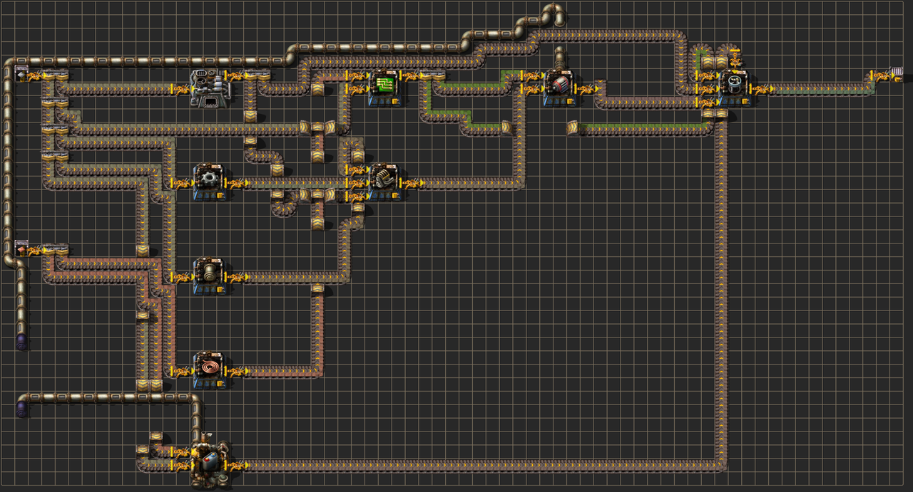
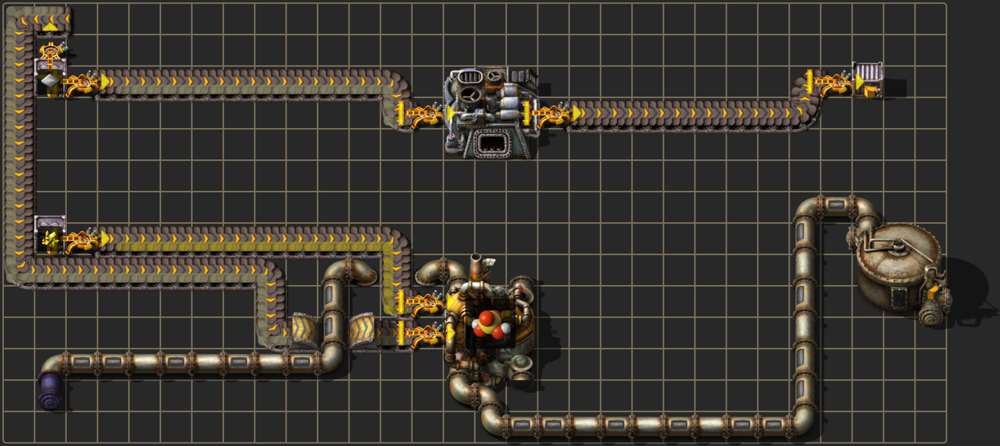

# fgr — a compilable high-level DSL for Factorio factories

**Idea under test:** describe a factory at a high level (a production *graph*), and
turn that into a real, buildable Factorio layout — where the messy physical
details (where each machine sits, every inserter, and the actual belt tile paths,
"belt lanes") are figured out by a *generator*, and a separate **verifier**
decides whether the produced layout actually realizes the spec.

The key insight (from the second design pass): the generator does **not** have to
be deterministic. It can be a heuristic placer, a search, or a model. What makes
the idea work is that the result is **independently verifiable** — we can tell,
exactly, whether a generated layout matches the requirements or not.

```
 .fgr DSL  ──parse──▶  Graph (spec)  ──generate──▶  Layout (placed entities)
                            │                              │
                            └──────────── verify ──────────┘   ← the oracle
                                                               │
                                            Factorio blueprint string ──▶ FBSR ──▶ PNG
```

## Gallery

Each factory below is **compiled from a few lines of DSL, verified, then rendered with
[FBSR](https://github.com/demodude4u/Factorio-FBSR)** (real game sprites).
📊 **[Open the full interactive report →](https://mrtsepa.github.io/factorio-dsl-compiler/report.html)**
— every example with its DSL source, the verifier's checks, and a one-click *copy blueprint*
button (also in [`docs/report.html`](docs/report.html)).

**`flying_robot_frame`** — a deep multi-step build with a furnace, oil/chemical **fluids**
(pipes + a storage tank), and reconvergent item belts:



**`sulfuric_acid`** — water piped into a chemical plant, acid out to a tank; items on belts,
fluids on pipes, each attaching at the machine's real fluid-box tiles:



**`processing_unit`** — reconvergent electronics with sulfuric acid as a fluid input:


**`circuits`** (an underground belt tunnels the iron lane under the cable lane) and **`bus`**
(one belt fanned out to many via a splitter bus):


## The DSL

Primitives: **input chest**, **assembler**, **furnace** (smelting), **chemical
plant** + **fluid source** (for fluid recipes), **output chest/tank**, and the
lanes between them — **belt lanes** (`->`) for items and **fluid lanes** (`~>`)
for pipes. You only write nodes and lanes; inserters, belts, **splitters** (fan-out/
merge), **underground belts** (crossings), and **pipes** (with the right fluid-box
attachment) are all synthesized by the compiler.

```
# examples/basic/gears.fgr
input     iron  : iron-plate          # an input chest stocked with iron plates
assembler gears : iron-gear-wheel     # an assembler crafting gears
output    out                         # an output chest

iron  -> gears                        # a belt lane: iron -> gears
gears -> out                          # a belt lane: gears -> out
```

- `A -> B -> C` chains expand to `A -> B` and `B -> C`.
- `A -> B, C, D` is **one belt off A** that a splitter bus fans out to several
  consumers — not three separate belts (`examples/basic/bus.fgr`, `examples/basic/fanout.fgr`).
- `A, B -> C` is the mirror — **two sources merged onto one belt** (a splitter
  combines them) feeding a single input inserter on C (`examples/basic/merge.fgr`).

More primitives for realistic recipes (`examples/complex/`):
- `furnace N : item` — smelting (electric-furnace), e.g. `furnace steel : steel-plate`.
- `chemical N : recipe` — a chemical plant, for any recipe that uses a **fluid**.
- `fluid N : fluid` — an infinite fluid source (infinity-pipe).
- `A ~> B` — a **fluid lane**: carried by **pipe**, not belt. Pipes attach at the
  entity's real **fluid-box** tiles, which rotate with the machine (the model is
  rotation-aware; chemical plants are kept north-facing so fluid boxes stay clear of
  the item inserters), and the verifier checks the pipe network actually reaches those
  fluid boxes — and that no network carries two fluids. See `examples/complex/sulfuric_acid.fgr`.
- Inputs are emitted as **infinity chests stocked with their item** (a regular
  chest can't carry contents in a blueprint), so the factory is actually runnable.
- The router lays **underground belts** to tunnel under obstacles, so lanes can
  cross (`examples/basic/circuits.fgr` tunnels the iron lane under the cable lane).

See `examples/basic/circuits.fgr` for a multi-input assembler + an underground crossing,
and `examples/basic/bus.fgr` for one belt feeding three consumers via splitters.

## Run it

```bash
uv venv --python 3.10 .venv && uv pip install pytest   # one-time
.venv/bin/python -m fgr compile examples/basic/gears.fgr     # compile + verify, print blueprint string
.venv/bin/python -m fgr verify  examples/basic/circuits.fgr  # just the verifier report
.venv/bin/python -m pytest -q                          # tests
```

To also render a game-accurate PNG, start the sibling **Factorio-FBSR** service
once, then pass `-o`:

```bash
( cd ../factorio-patch-prediction && scripts/fbsr_service.sh & )   # warm JVM + sprite atlas
.venv/bin/python -m fgr compile examples/basic/circuits.fgr -o out/circuits.png
```

(Override the FBSR wrapper path with `FGR_FBSR_SH=/path/to/fbsr.sh` if your repos
live elsewhere.) Rendering is **only** for visualization — correctness comes from
the verifier, not the picture.

## Repository layout

```
fgr/                 the package (DSL → IR → layout → verify → blueprint/encode → render)
examples/
  basic/             intro factories (gears, circuits, bus, fanout, merge, science)
  complex/           hand-authored realistic builds (furnaces, oil/chem fluids, deep chains)
  stress/            machine-generated complex DAGs — the stress battery
scripts/             stress_complex.py (battery harness) · independent_check.py · build_report.py
tests/               pytest suite (DSL, verifier, fluids, complex, blueprint, model-validation)
out/                 generated artifacts (blueprint strings, renders, report.html) — gitignored
README.md · STATUS.md   docs (STATUS.md = latest results + where it fails)
```

## How the pieces work

| file | role |
|------|------|
| `fgr/dsl.py` | parse `.fgr` text → `Graph` (the spec) |
| `fgr/ir.py` | the graph + Factorio direction/geometry constants |
| `fgr/layout.py` | **a** reference generator: layer into columns, place machines, attach inserters, route belt lanes (with underground crossings), fan out shared belts with splitters |
| `fgr/verify.py` | **the** generator-agnostic oracle (see below) |
| `fgr/blueprint.py` + `fgr/encode.py` | `Layout` → Factorio 2.0 blueprint dict → importable string |
| `fgr/render.py` | shell out to Factorio-FBSR for a PNG |
| `fgr/fbsr_validation.py` | check the verifier's geometry against Factorio's real data (via FBSR) |

### The verifier (the centerpiece)

`verify(graph, layout)` grades a candidate layout **physically**, not by trusting
the generator. It builds a directed *material-flow graph* over carriers (chest
tiles, an assembler's 3×3 body, individual belt tiles) using real Factorio
adjacency rules:

- an inserter at tile `T` takes an item from the tile it *faces* (`T + d`) and
  drops it on the opposite tile (`T − d`) — a Factorio inserter's blueprint
  `direction` points at its **pickup**, not its drop (the "inserters are stored
  reversed" quirk);
- a belt tile hands items to the carrier in front **iff** that carrier is another
  belt (loading a chest/assembler requires an inserter, which is its own edge).

It then searches that graph from each named node *without passing through other
named nodes*, yielding the set of **direct lanes physically present**. The layout
passes iff:

- no entities overlap, no inserter is dangling (empty pickup/drop),
- every node is placed once with the right prototype/recipe/item, and
- the set of physical lanes **equals the spec's edges** — every declared lane
  exists *and* there are no undeclared ones.

Because it works from geometry, it catches a layout that *looks* plausible but is
subtly broken. The tests delete a single belt tile and flip one inserter; both
flip the report to `FAIL` with the exact offending lane.

### Validating the verifier itself

The oracle is only as good as its model of the game — a wrong geometric
assumption makes it confidently bless broken layouts. (We hit exactly this: a
backwards guess about which way an inserter's `direction` points.) So the model is
checked against ground truth:

```bash
.venv/bin/python -m fgr validate-model      # (auto-skips if FBSR isn't built)
```

FBSR embeds Factorio's real `data.raw`; its `dump-entity` emits a prototype's
actual `pickup_position`, `insert_position`, and `selection_box`. `validate-model`
asserts that (1) the verifier's inserter rule reproduces the real rotated
pickup/insert tiles for **every** orientation, (2) a **probe** run of the real
`verify()` on a chest→inserter→chest layout discovers the lane in the
game-accurate direction (this exercises `verify.py`, not just its constants), and
(3) every entity footprint matches the `SIZE` table. Feeding the harness a
verifier with reversed inserter handling makes check (2) fail — so it has teeth.

This is a *static* validation: FBSR renders, it doesn't simulate, so it can't
prove throughput. But connectivity is a topological property of exactly these
geometric facts, so pinning them to real data closes the gap that caused the
inserter bug. A *dynamic* check (drive the real game over RCON, insert items, read
the output chest) is the natural next oracle — see bottleneck #2.

## What this POC reveals (the bottlenecks)

These are the real friction points to think about next — the POC exists to surface
them:

1. **Routing — now a rip-up/retry router.** The router lays **underground belts** to
   tunnel and **splitters** to fan out/merge; inserter ports use a node's whole
   perimeter (12 tiles on a 3×3, 4 on a chest); and lanes are routed with A* +
   **rip-up/retry + congestion history**, so dense many-to-many (a 4×4 crossbar) and
   ratio builds (`3 wire → 2 circuits`) now route. Remaining edge: it's still a
   heuristic — very large/tight graphs could exhaust the rip-up budget, and the
   greedy commit isn't globally optimal (layouts are valid, not minimal).
2. **Connectivity ≠ throughput.** The verifier checks that an item *can* travel
   A→B, not the *rate* (and a splitter is treated as "items can reach both
   outputs," not a 50/50 balancer). "Matches requirements" for a real factory
   eventually means belt saturation, inserter speed, and *how many* assemblers
   hit a target output — none of that is modeled yet.
3. **Belts are item-agnostic.** A path is verified, but not that the *right* item
   flows down it (e.g. that the circuit assembler's two inputs get iron vs. cable,
   not crossed). Propagating item identity from inputs/recipes is the next verifier
   upgrade.
4. **Manifolds are rigid (the current ceiling).** `A -> B, C` (fan-out) and
   `A, B -> C` (merge) build splitter chains, but the fan-out chain is *compact* and its
   peel tails run as long diagonals to spread-out consumers; past ~6 consumers those tails
   saturate the corridor and the router gives up. This is the root cause of the remaining
   stress failures — a row-aligned *bus* manifold (short straight peels) is the fix. See
   `STATUS.md` for the current pass rate and the exact failing cases.
5. **Buildability gaps.** Power poles are still ignored. (Fluids *are* handled now —
   pipes, pipe-to-ground, real fluid boxes, one-fluid-per-network.) Inputs use infinity
   chests, so the factory only "runs" in sandbox/editor.
6. **Node↔entity correspondence.** Two identical assemblers are indistinguishable,
   so the layout must declare which machine is which named node; a model-generator
   would have to emit that mapping (or the verifier infer it — ambiguous).
7. **DAG only.** Layering assumes an acyclic graph.

The encouraging part: items 2–3 are *verifier* enrichments (the oracle gets
stronger), and items 1 & 4 are *generator* improvements — and the architecture
already separates those two concerns.
