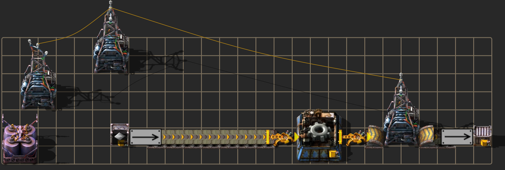
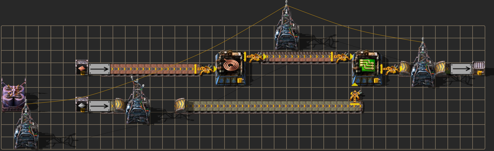
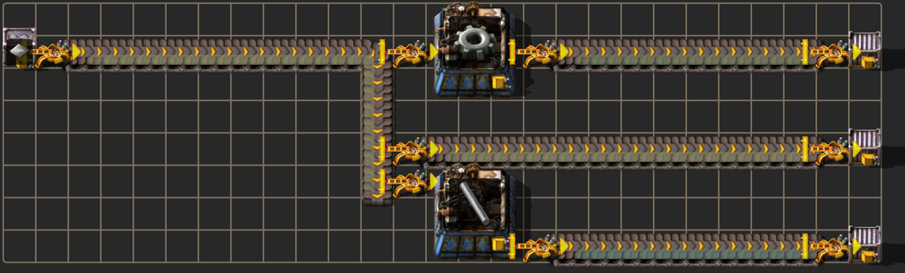
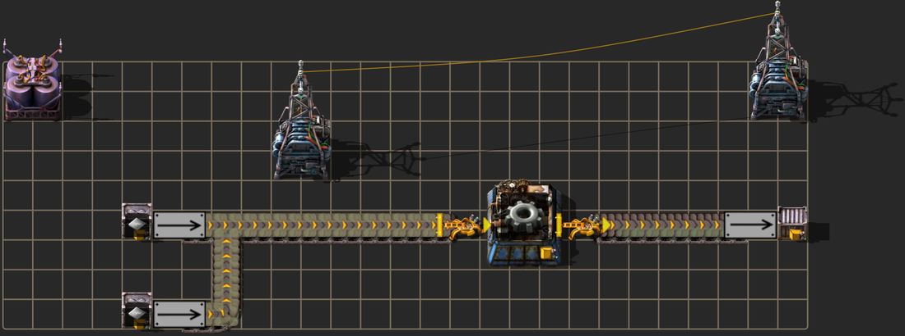
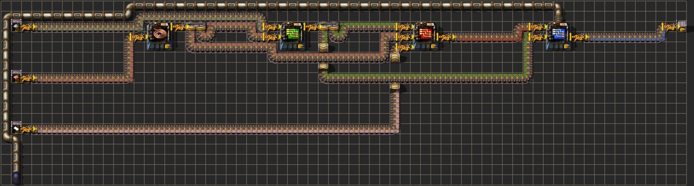
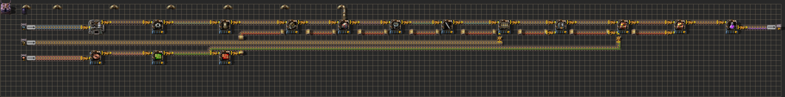
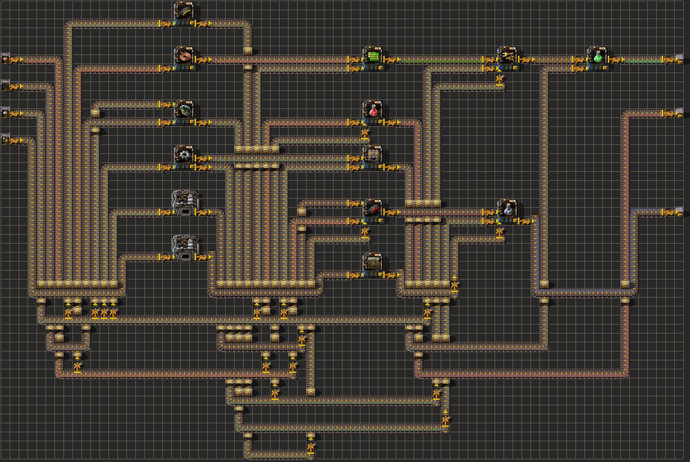

# fgr — describe a factory, get a Factorio blueprint

Write what you want to build as a little graph — *these chests, these machines, and the
belts and pipes between them* — and `fgr` works out the **actual layout**: where every
machine, inserter, belt, underground, and pipe goes. Then it hands you an importable
**Factorio blueprint string**.

The interesting twist: a separate **verifier** reads the placed tiles and confirms the
layout *really* does what you asked — every belt and pipe actually connects, nothing is
crossed or missing. So the part that draws the layout can be anything (a heuristic, a
search, a model); the verifier is the impartial judge of whether it got it right.

And it goes past connectivity: annotate a spec with a **throughput target**
(`output chips @ 15/s` or `input iron : iron-plate @ 1 belt`) and the **rate solver**
sizes the whole factory — machine counts, multi-inserter feeds, the number of input
belts — then the blueprint is **measured in the real game** (headless Factorio) to close
the loop. Every blueprint is paste-and-run: powered, fed by full belts at the boundary,
verified before you ever see it.

📊 **[Browse the full visual report →](https://mrtsepa.github.io/factorio-dsl-compiler/report.html)**
— every example rendered, with its DSL, sizing plan, the verifier's checks, and a
*copy blueprint* button.

## Gallery

You write the DSL on the left; `fgr` produces the layout on the right (rendered with
[Factorio-FBSR](https://github.com/demodude4u/Factorio-FBSR) for real in-game sprites).
These images are generated straight from the `.fgr` files by `scripts/gen_gallery.py`, so
they always match the source.

<!-- GALLERY:START (generated by scripts/gen_gallery.py — do not edit by hand) -->

### `gears`

The hello-world: an input chest of iron plates → an assembler making gears → an output chest, laid out as one tight aligned line.

```text
# The "hello world" factory: turn iron plates into gears, ship the gears out.
#
#   input chest --belt--> assembler (iron-gear-wheel) --belt--> output chest
#
# We declare WHAT the factory is; the compiler decides WHERE everything goes
# (assembler position, inserters, and the actual belt tile paths) and the
# verifier confirms the placed layout really carries items along each lane.

input     iron  : iron-plate
assembler gears : iron-gear-wheel
output    out

iron  -> gears
gears -> out
```



### `circuits`

Two ingredients into one assembler — copper→cable→circuit on the spine, with the iron lane routed to the circuit's second input.

```text
# A two-stage factory with a multi-input assembler.
#
# copper-plate -> copper-cable -.
#                                +-> electronic-circuit -> output
# iron-plate -------------------'
#
# `circuit` pulls TWO lanes (iron + cable); the compiler must give it two input
# inserters on its west side and route both belt lanes without collisions. The
# iron lane also has to travel PAST the cable column to reach the circuit column.

input     copper  : copper-plate
input     iron    : iron-plate
assembler cable   : copper-cable
assembler circuit : electronic-circuit
output    chips

copper -> cable
cable  -> circuit
iron   -> circuit
circuit -> chips
```



### `bus`

`A -> B, C, D` — one belt off A, tapped by an inline inserter per consumer (NO splitters). This is the canonical 'one belt feeds many machines' pattern.

```text
# One belt feeding several consumers, tapped by inline inserters (NO splitters).
#
#                         .-> assembler gears   -> out_gears
#   iron --(one belt)----+--> assembler sticks  -> out_sticks
#                         '-> output  out_raw
#
# `iron -> gears, sticks, out_raw` is a SINGLE output belt off the iron chest; each
# consumer taps it with its own inserter where the belt passes (the canonical "one
# belt feeds many machines" pattern — no splitter gadget). Contrast with three
# separate `iron -> ...` lines, which would demand three output inserters on the
# (1x1) iron chest — impossible. The shared belt needs only one.

input     iron    : iron-plate
assembler gears   : iron-gear-wheel
assembler sticks  : iron-stick
output    out_gears
output    out_sticks
output    out_raw

iron  -> gears, sticks, out_raw
gears  -> out_gears
sticks -> out_sticks
```



### `merge`

`A, B -> C` — each source keeps its own belt and both tap C directly (a multi-tap merge, no splitter gadget).

```text
# Merge: two sources into one machine, each tapping it directly (NO splitter).
#
#   iron_a --.
#            +--> assembler gears -> out
#   iron_b --'
#
# `iron_a, iron_b -> gears` is the mirror of fan-out: each source keeps its own
# belt and taps `gears` with its own input inserter (on a distinct face) — a
# multi-tap merge, no splitter/merge gadget.

input     iron_a : iron-plate
input     iron_b : iron-plate
assembler gears  : iron-gear-wheel
output    out

iron_a, iron_b -> gears
gears -> out
```



### `processing_unit`

Reconvergent electronics (copper→cable→green→red→blue with skip-edges) **plus** sulfuric acid piped in — fluids tunnel under the belt field into the chemical/assembler fluid boxes.



<details><summary>show the DSL</summary>

```text
# Deep electronics: copper-plate -> cable -> green -> red -> blue (processing-unit).
# Reconvergent (cable->green,red; green->red,blue). Sulfuric acid is a FLUID (~>).
input iron : iron-plate
input copper : copper-plate
input plastic : plastic-bar
fluid acid : sulfuric-acid
assembler cable : copper-cable
assembler green : electronic-circuit
assembler red : advanced-circuit
assembler blue : processing-unit   # processing-unit needs sulfuric-acid (crafting-with-fluid) -> assembler
output chips
copper -> cable
cable -> green, red
iron -> green
green -> red, blue
plastic -> red
red -> blue
acid ~> blue
blue -> chips
```

</details>

### `deepchain_4`

A deep multi-stage build — clean repeating machine cells along the spine.



<details><summary>show the DSL</summary>

```text
# deepchain_4: the depth stress test. One very long spine (depth 14) climbing the
# iron tech progression from ore all the way to production science, with a few
# long cross-column lanes from an electronics branch feeding deep spine columns.

input     iron_ore   : iron-ore
input     copper     : copper-plate
input     stone      : stone
fluid     lube       : lubricant

furnace   iron_plate : iron-plate
assembler gear       : iron-gear-wheel
assembler pipe_part  : pipe
assembler engine     : engine-unit
assembler  eengine    : electric-engine-unit
assembler frame      : flying-robot-frame
assembler stick      : iron-stick
assembler rail       : rail
assembler efurnace   : electric-furnace
assembler prod_mod   : productivity-module
assembler prod_mod2  : productivity-module-2
assembler prod_sci   : production-science-pack
output    out

# electronics branch (the long cross-column lanes)
assembler cable      : copper-cable
assembler green      : electronic-circuit
assembler red        : advanced-circuit

# --- the deep spine (depth 14) ---
iron_ore -> iron_plate -> gear -> pipe_part -> engine -> eengine -> frame -> stick -> rail -> efurnace -> prod_mod -> prod_mod2 -> prod_sci -> out

# --- electric engine needs lubricant (fluid) ---
lube ~> eengine

# --- electronics branch + long lanes into deep spine columns ---
copper -> cable -> green -> red
red -> efurnace
green -> prod_mod
red -> prod_mod
red -> prod_mod2

# --- rail also needs stone ---
stone -> rail
```

</details>

### `science_3`

A larger factory with furnaces and fluids, fully verified.



<details><summary>show the DSL</summary>

```text
# science_3: red + green + military science mall, furnace-heavy (steel + brick),
# using a merge (coal + iron -> grenade). No fluids; all items on belts.
#   red      = automation-science-pack = copper-plate + iron-gear-wheel
#   green    = logistic-science-pack   = inserter + transport-belt
#   military = military-science-pack    = piercing-rounds-magazine + grenade + stone-wall

input iron : iron-plate
input copper : copper-plate
input coal : coal
input stone : stone

furnace steel : steel-plate
furnace brick : stone-brick

assembler gear : iron-gear-wheel
assembler cable : copper-cable
assembler green_chip : electronic-circuit
assembler arm : inserter
assembler belt : transport-belt
assembler firearm_mag : firearm-magazine
assembler pierce : piercing-rounds-magazine
assembler grenade : grenade
assembler wall : stone-wall
assembler redsci : automation-science-pack
assembler greensci : logistic-science-pack
assembler milsci : military-science-pack

output red_out
output green_out
output mil_out

# raw distribution
iron -> gear, green_chip, arm, belt, steel, firearm_mag
copper -> cable, redsci, pierce
stone -> brick

# merge: two belts feed the grenade line
coal, iron -> grenade

# smelting
steel -> pierce
brick -> wall

# circuits / movement
cable -> green_chip
green_chip -> arm
gear -> arm, belt, redsci

# ammo line
firearm_mag -> pierce

# science assembly
pierce -> milsci
grenade -> milsci
wall -> milsci
arm -> greensci
belt -> greensci

redsci -> red_out
greensci -> green_out
milsci -> mil_out
```

</details>

<!-- GALLERY:END -->

## Write a factory

A `.fgr` file lists nodes and the lanes between them (one per line, `#` for comments):

```text
input     iron  : iron-plate          # a chest stocked with iron plates
assembler gears : iron-gear-wheel      # an assembler crafting gears
output    out

iron  -> gears                         # a belt lane (items)
gears -> out
```

- **Nodes:** `input` / `output` chests, `assembler`, `furnace` (smelting), `chemical`
  plant, and `fluid` (an infinite fluid source).
- **Item lanes** with `->`:  `A -> B -> C` chains · `A -> B, C` fans one belt out to many
  (each consumer taps it with an inline inserter — no splitters) · `A, B -> C` merges by
  having each source tap the machine directly.
- **Fluid lanes** with `~>`:  carried on **pipes**, into chemical plants / fluid-recipe
  assemblers / tanks.

You only ever write nodes and lanes — inserters, belt paths, underground belts, and pipes
are all figured out for you.

## Try it

```bash
uv venv --python 3.10 .venv && uv pip install pytest        # one-time
.venv/bin/python -m fgr compile examples/basic/gears.fgr    # compile + verify, print the blueprint
.venv/bin/python -m fgr verify  examples/complex/sulfuric_acid.fgr
.venv/bin/python -m fgr solve   examples/sized/gears_belt.fgr   # size to a rate target
.venv/bin/python -m fgr rates   examples/basic/circuits.fgr     # throughput metadata
.venv/bin/python -m pytest -q                               # the test suite
```

To *measure* a blueprint in the actual game (optional, used by the rate studies):

```bash
scripts/get_factorio.sh                    # pinned free headless build -> out/_factorio_sim
.venv/bin/python scripts/rate_study.py     # micro-benchmarks + corpus runs (Docker on macOS)
```

Rendering a PNG is **optional** — the gallery images and report here are pre-rendered, and
correctness comes from the verifier, not the picture. Game-accurate rendering uses
[Factorio-FBSR](https://github.com/demodude4u/Factorio-FBSR), which has to bake sprites from
*your* Factorio install (Wube's assets aren't redistributable), so it's a bring-your-own
setup — see **[docs/RENDERING.md](docs/RENDERING.md)**. Once set up:

```bash
export FBSR_HOME=/path/to/Factorio-FBSR/FactorioBlueprintStringRenderer   # your built FBSR
.venv/bin/python -m fgr compile examples/basic/circuits.fgr -o out/circuits.png
```

## Under the hood

The **verifier is the centerpiece.** Instead of trusting the layout generator, it rebuilds
a material-flow graph from the placed tiles using real Factorio rules — an inserter picks
from the tile it faces and drops on the opposite one; a belt hands off to the belt in front;
a pipe connects to adjacent pipes and across an underground tunnel; a chemical plant's fluid
boxes sit at fixed (rotating) tiles. A layout **passes** only if nothing overlaps, no
inserter is dangling, every node is the right machine, the set of physically-present
lanes *exactly* equals the spec — every declared lane present, no extra ones, no two
fluids sharing a pipe network — and no two products share a belt **side**: a belt has two
lanes, and the checker tracks real lane physics (side-loads collapse onto the near lane,
curves preserve lanes, underground ends take side-loads with their hood filtering one
feeder lane, inserters drop on the far lane), so two products may share a belt only when
properly lane-separated. Since v3 grew a **power overlay**, a pass also means the grid is
live: substations cover every machine and inserter, wire-connected to an
electric-energy-interface — paste the blueprint into a sandbox world and it **runs**,
with infinity chests feeding **full belts** through vanilla loaders at both ends.

Because the verifier is generator-agnostic, the layout generator itself is **swappable** —
three live side by side behind one interface (`fgr.generators`):

| generator | approach | pass rate\* | avg compile\*\* | notes |
|---|---|---|---|---|
| **v3** (default) | v2's placement + a **global negotiated-congestion router** (PathFinder-style) | **161 / 161** | 114 ms | passes the whole battery; leanest layouts (fewest entities/turns) |
| v2 | deterministic **lane fabric**: 4 fixed passes, no search, no rip-up | 121 / 161 | **24 ms** | fastest; fails lane-purity + power checks its era predates |
| v1 | fixed grid + **A\* rip-up** search router | 124 / 161 | 423 ms | can hang on large/congested graphs (11/161 timeouts) |

<sub>\*across `examples/` (55 curated, incl. the sized specs compiled plain) +
`corner_cases/` (106 generated stress cases), each `(case, generator)` pair
subprocess-isolated with a 10s cap. Compile times are each generator's own passing set.</sub>

```bash
.venv/bin/python -m fgr compile examples/basic/gears.fgr -g v2   # pick a generator explicitly
.venv/bin/python scripts/compare_generators.py --corner-cases    # full head-to-head, live numbers
```

v3 treats routing the way FPGA place-and-route does (see `docs/INSPIRATION.md`): each
producer's fan-out is one multi-terminal net with **flexible pins** — the search chooses
machine faces, taps its own trunk, bridges adjacent machines with a single inserter, or
merges into another lane bound for the same consumer *carrying the same product* (collector
belts *emerge* under high fan-in; different products keep whole belts to themselves for
throughput, pairing onto opposite lane sides only when a sink has more products than
faces) — and all nets negotiate for tiles under growing congestion prices instead of
claiming them greedily. That closes every tracked v1/v2 failure while producing the leanest
layouts of the three (fewest entities, 10× fewer belt turns than v2). See
**[STATUS.md](STATUS.md)** for the full comparative analysis.

Because the oracle is only as good as its model of the game, that model is checked against
ground truth — `fgr validate-model` asserts the inserter/fluid-box/underground geometry
matches Factorio's real prototype data (via FBSR), and a separate check confirms each
recipe is actually craftable by its machine *and fed its real ingredients on the right
lanes* (the game-accuracy audit — curated examples must use real recipes). Both auto-skip
if FBSR isn't installed.

## Rates: from "it connects" to "it delivers N per second"

Connectivity is necessary, not sufficient — so throughput is handled as a stack of three
layers, each validating the one above ([docs/RATES.md](docs/RATES.md) has the design,
[docs/rate_analysis.html](https://mrtsepa.github.io/factorio-dsl-compiler/rate_analysis.html)
the measurement deep-dive with plots):

- **Metadata (`fgr rates`)** — every compiled blueprint's in-game description carries its
  expected throughput and bottleneck, computed from Factorio's prototype dumps plus a
  **calibration table measured in the game** (the game quantizes inserter swings to whole
  ticks — 60/70 ticks ≈ 0.857/s from a chest, 60/64 ≈ 0.938/s off a belt — analytic
  formulas chronically mispredict).
- **The rate solver (`fgr solve`)** — annotate an input (`@ 1 belt`, max-output mode) or
  an output (`@ 15/s`, sizing mode) and the solver expands the spec into a sized graph:
  machine copies, **multi-inserter feeds** (up to 3 arms per ingredient, 2 output arms —
  expressed structurally, so the router just routes them), input lanes derived as
  `ceil(draw / capacity)`, and belts planned to ≤92% of capacity because taps drain in
  priority order — a 100%-loaded belt permanently starves its tail machines. Plans report
  a guaranteed floor *and* the expected actual rate (machines run at their caps, not at
  plans).
- **Game-in-the-loop (`scripts/simulate.py`)** — a pinned **headless Factorio** (installed
  by `scripts/get_factorio.sh`, run in Docker on macOS, native on Linux) boots the
  blueprint in a scenario and measures per-output and per-machine production. Machine-bound
  builds land within 2–4% of prediction: a one-belt gear factory sizes to **5 machines
  (3 iron arms + 2 output arms each), measured 6.75 gears/s at 84–100% duty on every
  machine**; a full-belt (15/s) electronic-circuit factory sizes to 45 machines and
  verifies at 12.8k entities — from an 8-line spec.

Everything inside a blueprint is **vanilla-buildable**; the boundary scaffolding (infinity
chests, loaders, the power interface) is exactly what you replace when splicing the build
into a real base.

<details><summary>How the code is organized</summary>

```
fgr/                 the package (dsl → ir → solver → layout(s) → verify → blueprint → render)
examples/
  basic/             intro factories (gears, circuits, bus, fanout, merge, science)
  complex/           hand-authored realistic builds (furnaces, oil/chem fluids, deep chains)
  sized/             rate-solver specs with @rate targets (sim-validated)
  stress/            machine-generated complex DAGs — the stress battery
corner_cases/        standalone failure-hunting corpus (106 cases; not in the gating suite)
scripts/             compare_generators (3-way head-to-head) · simulate (headless Factorio)
                     · rate_study + build_rate_analysis (measurement deep-dive)
                     · get_factorio.sh · build_report · build_pdf · gen_gallery
                     · stress_complex · independent_check · audit_specs
tests/               the pytest suite
docs/                the committed report, RATES/INSPIRATION design docs, rate analysis,
                     gallery images (served on GitHub Pages)
```

| file | role |
|------|------|
| `fgr/dsl.py` | parse `.fgr` text (incl. `@ rate` annotations) → a `Graph` (the spec) |
| `fgr/solver.py` | the rate solver: sized graph (machine copies, arms, ports, lanes) + plan |
| `fgr/rates.py` | throughput metadata from prototype dumps + game-measured calibration |
| `fgr/generators.py` | the registry: `compile_graph(graph, "v1"\|"v2"\|"v3")` — pick a generator by name |
| `fgr/layout_v3.py` | **v3**, the default generator: global negotiated-congestion router |
| `fgr/layout.py` | **v2**: deterministic lane-fabric router (also v3's placement passes) |
| `fgr/layout_v1.py` | **v1**, the original fixed-grid + A\* rip-up router (historical baseline) |
| `fgr/power.py` | substation grid + electric interface, planned before routing |
| `fgr/verify.py` | **the** generator-agnostic oracle (incl. lane purity + power checks) |
| `fgr/blueprint.py` + `fgr/encode.py` | `Layout` → Factorio 2.0 blueprint string (wires, loaders, rates tooltip) |
| `fgr/fbsr_validation.py` | check the model (geometry, recipes, real ingredients) against Factorio data |
| `scripts/simulate.py` | boot a blueprint in headless Factorio, sample per-chest/per-machine production |

</details>

## What this POC shows (and where it strains)

It works end-to-end: a high-level graph — optionally with a throughput target — becomes a
real, verified, **powered, paste-and-run** layout, sized to its rate, with its expected
throughput in the blueprint tooltip and, for the studied cases, measured in the actual
game. It also demonstrates the premise itself: **three** generators (v1's search router,
v2's deterministic lane fabric, v3's global negotiated router) sit behind the same
interface and are graded by the same independent oracle — swap the generator, keep the
guarantee. Each generation was graded against its predecessor by that oracle before
becoming the default. `STATUS.md` has the full comparative analysis.

The honest edges, all measured rather than suspected:
- The verifier certifies *connectivity*; the rate solver's plans are validated by
  simulation, but a static **capacity check inside the verifier** (PASS ⇒ every link
  sustains the plan) is still on the list.
- Sized builds at scale converge slowly in-game: dedicated lanes stretch long, and
  filling belts dominates warm-up (the 45-machine full-belt circuit factory ramps for
  tens of game-minutes). The structural fix — **bank-row placement / direct insertion**
  (machines sharing short trunk belts) — is the next milestone, along with splitters.
- v3's negotiation is bounded: a graph whose contention never converges emits its best
  attempt for the verifier to grade; growing `corner_cases/` until one exists is the
  standing failure hunt.

The architecture keeps the generators and the verifier cleanly separated so each can grow
on its own — the generator is swappable; the verifier is the oracle.
